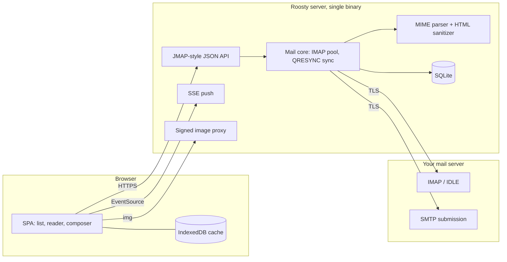

# Architecture

Status: draft, open for discussion. Decisions marked **open** are not final.

## Principles

1. **Light by budget.** Every target below becomes a CI check that fails the build.
2. **Safe by default.** Remote content blocked, HTML isolated, no telemetry.
3. **One binary, one container.** Self-host in minutes on amd64 or arm64.
4. **Customizable without breaking.** Themes are validated data, not arbitrary CSS.
5. **JMAP-ready.** The internal API follows the JMAP model so a JMAP backend can replace IMAP later.

## Performance budget

| Metric | Target |
|---|---|
| Initial JS + CSS (gzip, without the editor) | ≤ 120 KB |
| Inbox visible (4G, cold cache) | < 1 s |
| Open a cached message | < 150 ms |
| Scrolling a folder with 50,000 messages | 60 fps |
| Server RAM when idle | < 40 MB |
| RAM per active session with IDLE | ~2 MB |

## Overview



The mail server stays the source of truth. The Roosty server stores only sessions, preferences, themes, identities and an optional header cache.

## Server modules

| Package | Responsibility | Based on |
|---|---|---|
| `auth` | Login against IMAP, split-key sessions, CSRF, rate limiting, optional TOTP | `net/http` |
| `imapx` | Connection pool, capability detection and fallbacks, IDLE/NOTIFY | `emersion/go-imap` v2 (beta, pinned) |
| `sync` | Per-folder state (UIDVALIDITY, HIGHESTMODSEQ), deltas via CONDSTORE/QRESYNC | own |
| `mime` | Parsing, charsets, TNEF, attachments, previews | `emersion/go-message`, `x/text` |
| `sanitize` | HTML allowlist, CSS policy, URL rewriting, tracker removal | `bluemonday` + own CSS policy |
| `imgproxy` | Remote images with HMAC-signed URLs and SSRF protection | own |
| `submit` | SMTP send, append to Sent, undo-send queue | `emersion/go-smtp` |
| `store` | Preferences, themes, identities, header cache | SQLite (`modernc.org/sqlite`, no CGO) |
| `api`, `push` | Batched JMAP-style methods, SSE with state strings | own |

## API

A single `POST /api` takes a batch of method calls, and a call can reference the result of an earlier one, as in JMAP (RFC 8620/8621). Opening a folder is one request.

```json
{ "calls": [
  ["Mailbox/get", {}, "m"],
  ["Email/query", {"filter": {"inMailbox": "INBOX"}, "sort": [{"property": "receivedAt", "isAscending": false}],
                   "position": 0, "limit": 60, "collapseThreads": true}, "q"],
  ["Email/get",   {"#ids": {"resultOf": "q", "path": "/ids"},
                   "properties": ["threadId", "from", "subject", "preview", "receivedAt", "keywords", "hasAttachment"]}, "g"]
]}
```

Every response carries a `state`. The client stores it and later asks only for changes with `Email/changes`.

## Key problems and chosen approaches

| # | Problem | Approach |
|---|---|---|
| 1 | XSS through email HTML | Defense in depth: server sanitizer, DOMPurify on the client, sandboxed `srcdoc` iframe without scripts, strict CSP, XSS corpus and fuzzing in CI. SVG and MathML are never rendered inline. |
| 2 | Remote images, trackers, SSRF | Signed image proxy: resolve DNS first, block private and link-local ranges, re-check on every redirect, images only, size and time limits, no cookies or Referer. Per-sender allowlist and a visible tracker count. |
| 3 | IMAP server differences | Capability matrix with a fallback per feature (MOVE, SPECIAL-USE, SORT, THREAD, OBJECTID, NOTIFY…). Integration tests against Dovecot, Stalwart, Cyrus and GreenMail in CI. |
| 4 | Malformed MIME and charsets | Tolerant parser, charset detection when headers lie, TNEF support, regression corpus in `testdata/mime/`, Go fuzzing. |
| 5 | Large mailboxes | Hybrid sync: header-only cache on the server (optional) plus IndexedDB on the client, deltas via QRESYNC, cache keys by EMAILID when available, virtualized lists, prefetch. One sync shared by all tabs through a SharedWorker. |
| 6 | Search | Server `SEARCH`/`ESEARCH` for bodies, local SQLite FTS5 over headers for instant results, Gmail-style operators. |
| 7 | Threading | Server THREADID or `THREAD=REFERENCES` when available, JWZ algorithm otherwise. |
| 8 | Composer | Editor loaded on demand, drafts saved locally and to the Drafts folder, resumable uploads, undo send through a short server-side queue. |
| 9 | Credentials | IMAP password encrypted with a key that exists only in the session cookie. OAuth2 and OIDC later. |
| 10 | IDLE at scale | One IDLE connection per active session on INBOX, NOTIFY or periodic STATUS for other folders, released when the tab is hidden. |
| 11 | Customization | Themes as validated JSON with contrast checks. Accent scale generated in OKLCH. Custom CSS only for instance admins. |
| 12 | Plugins | None in v1. Server plugins in WASM later, then sandboxed UI plugins. |

## Themes

Every theme, built-in or user-made, is a JSON file with the same schema, applied as CSS variables. The accent color is global: the user picks one and it applies to every theme; each theme has its own default.

Built-in themes: Light, Graphite, Black (OLED), Navy, Purple, Beige, Sepia, High contrast, Forest, Mist.

```json
{
  "$schema": "https://roosty.dev/schema/theme-v1.json",
  "id": "navy",
  "name": "Navy",
  "mode": "dark",
  "colors": {
    "bg": "#0E1A2E", "sidebar": "#0A1424", "surface": "#13213A", "surface-2": "#16243C",
    "border": "#22334F", "text": "#E4EAF4", "text-muted": "#8D9BB4",
    "accent": "#F2B84B",
    "danger": "#FF8A80", "success": "#6FD3A0", "warning": "#F2B84B",
    "mail-canvas": "#FFFFFF"
  },
  "radius": 8,
  "font-ui": "system"
}
```

`mail-canvas` matters in dark themes: most HTML email is designed for a white background, so by default it renders on a light "paper" surface.

## Open decisions

- **Backend language:** Go (lighter, single binary, but go-imap v2 is still beta) or Bun + imapflow (mature IMAP library, more RAM). Plan: a one-week prototype of each, measured against a real provider.
- **Frontend:** SolidJS or Svelte 5.
- **Header cache:** on by default for speed, with a clear switch to keep zero message data on the server.
